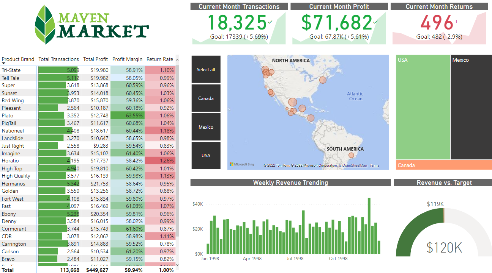
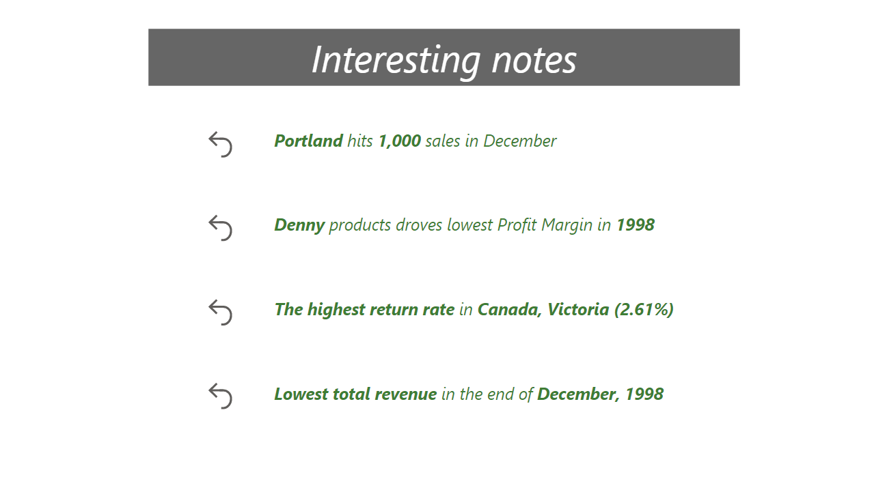
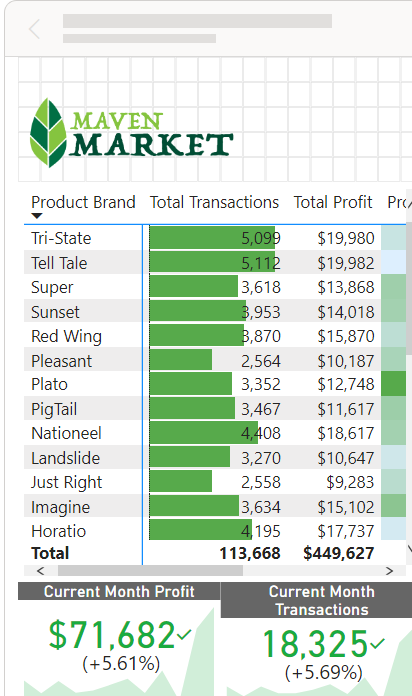

# Power Bi report Maven Market

## Table of Contents
* [General Info](#general-info)
* [Technologies Used](#technologies-used)
* [Features](#features)
* [Screenshots](#screenshots)
* [Setup](#setup)
* [Project Status](#project-status)

## General Info
The project focus to put into practice knowledge gathered at [course](https://www.udemy.com/course/microsoft-power-bi-up-running-with-power-bi-desktop/) on Udemy

## Technologies used
* Power Bi Version: 2.109.1021.0

## Features
* presenting data in readable graphs and charts
* creating measures and analyzing data with DAX language
* creating and managing relatchionships, filters
* introducing mobile view

## Screenshots

 

 

## Setup
Proceed to install [Power Bi Desktop](https://www.microsoft.com/en-us/download/details.aspx?id=58494) to get started with the project.

## Project status
The project is finished.
